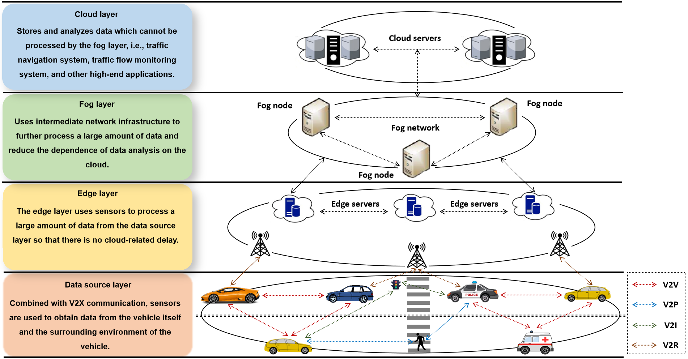

# Internet of Vehicles
The Internet of Vehicles (IoV) is an application of Internet of Things (IoT) in the context of intelligent transportation systems (ITS). The IoV has a similar architecture to the IoT and features a hierarchical structure that includes data source, edge, fog, and the cloud layers. Vehicles share information with other vehicles, pedestrians, intelligent infrastructure, and backbone networks to establish vehicle-to-vehicle, vehicle-to pedestrian, vehicle-to-infrastructure, and vehicle-to-network communication, thereby formulating vehicle-to-everything (V2X) communication. Figure 1 thus depicts the architecture of an IoV network. The main IoV communication node is a vehicle with an on-board unit (OBU) which can communicate with the Roadside Units (RSUs) and other vehicles in its proximity.       Figure 1. A system architecture of the IoV.   
# Trust in the Internet of Vehicles
Due to the unique characteristics of IoV, i.e., openness, dynamic topology, and high mobility, it is susceptible to attacks; dishonest entities can modify legitimate security messages, spread forged information, or delay forwarding messages, thereby endangering human lives. Accordingly, researchers have proposed several solutions for handling the issues pertinent to IoV security. Nevertheless, a number of these solutions rely on conventional cryptographic-related schemes and, therefore, rely on the notions of digital signatures, certificates, and public key infrastructure. Moreover, conventional cryptographicrelated schemes are only capable of mitigating external attacks and are ineffective against internal network attacks. It is due to this reason that the paradigm of trust has been recently introduced in the research literature. Trust is generally referred to as the confidence of a trustor in a trustee. Here, trustor refers to a node that is in a position to ascertain the trust of the other node (trustee) in the network, whereas the trustee refers to a node whose trust is being ascertained. In the context of the proposed dataset, trust refers to the likelihood that a trustee can perform a particular operation within a specific situation at a specific time. It is also important to mention that trust computation primarily involves a weighted aggregation of both the direct trust and the indirect trust. Direct trust is ascertained as a result of direct interactions between a trustor and a trustee and is generally referred to as a trustor’s direct observation of a trustee. On the contrary, indirect trust is computed by taking into account the direct trust ascertained by the one-hop neighbors of a trustor pertinent to a trustee.  
# Data Description
The envisaged trust-based IoV dataset employs Java for designing an IoV-based simulator, whereas, Python for analyzing the simulation results. The traces in this particular dataset transpired as a result of a simulation carried out for a duration of *1* hour via the IoV-based simulator. The IoV simulator takes into account several interconnected road segments in order to mimic a road network encompassing vehicles traversing at random speeds in disparate directions. Vehicles, accordingly, interact with one another and exchange indispensable information in order to realize a number of safety and non-safety applications. Moreover, the proposed IoV-based simulator incorporates not only honest vehicles but also intelligent malicious ones that dynamically alternate between honest and dishonest behaviors while executing malicious acts to evade classification as threats by the IoV network.  
The proposed dataset comprises *79* vehicles engaging in a total of *96,707* interactions at different time instances. In total, we ascertained *9* trust parameter values, i.e., packet delivery rate, similarity, external similarity, internal similarity, familiarity, external familiarity, internal familiarity, reward/punishment, and context. These parameters not only depict the dynamic interactions among vehicles but also provide insights into the IoV network scenario within which the vehicles operate.  
**Trustor** - The trustor assumes the role of an evaluator within an IoV network to assess and ascertain the trustworthiness of a trustee. In our proposed dataset, there are *79* trustors listed in *column 1* of the dataset.  
**Trustee** - The trustee, also referred to as a target node or a host node, is an entity that is evaluated by a trustor as either trustworthy or untrustworthy. In our proposed dataset, there are *79* trustees (listed in *column 2* of the dataset) that have encountered *96,707* interactions with trustors.   
**Packet Delivery Rate (PDR)** - The Packet Delivery Rate (0=< PDR <=1) measures the degree of interaction between a trustor and a trustee at a time instance *t* within an IoV network, thereby providing a key understanding of their relationship (listed in *column 3* of the dataset).   
**Similarity (Sim)** - The similarity (0=< Sim <=1) between a trustor and a trustee at a time instance *t* encompasses both external similarity (ES) and internal similarity (IS), and is a weighted amalgamation of the two, and is listed in *column 4* of the dataset.  
**External Similarity (ES)** - The external similarity (0=< ES <=1) suggests the extent to which a trustor and a trustee access similar content at a time instance *t*, and is listed in *column 5* of the dataset.  
**Internal Similarity (IS)** - The internal similarity (0=< IS <=1) manifests the degree of similarity in the positions (geographical locations), directions (travelling trajectories), speeds and accelerations of a trustor and trustee, and is depicted in *column 6* of the dataset.  
**Familiarity (Fam)** - The familiarity (0=< Fam <=1) between a trustor and a trustee at a time instance *t* is also segregated into external familiarity (EF) and internal familiarity (IF), and is delineated in *column 7* of the dataset.  
**External Familiarity (EF)** - The external familiarity (0=< EF <=1) quantifies the level of familiarity a trustor possesses towards a trustee, and is listed in *column 8* of the dataset. The value of EF is obtained by calculating the ratio between the number of common vehicles that interact with both trustor and trustee, and the total number of vehicles that interact with trustor over a given timestamp.  
**Internal Familiarity (IF)** - The internal familiarity (0=< IF <=1) denotes the extent of interaction frequency between trustor and trustee over time instance *t*, and is recorded in *column 9* of the dataset.   
**Reward / Punishment (RP)** - The reward and punishment (0=< RP <=1) is utilized to assess the rewards and penalties allocated to a trustee by a trustor based on its conduct, specifically, a trustee is rewarded by a trustor for exhibiting cooperation, honesty, and reporting critical events while being penalized for any misconduct, and is represented in column *10* of the dataset.   
**Context** - The context (0=< context <=1) means the vehicle network communication quality, and is listed in *column 11* of the dataset.  
# Related Paper(s)
1. Wang Y, Mahmood A, Sabri MFM, Zen H, Kho LC. MESMERIC: Machine Learning-Based Trust Management Mechanism for the Internet of Vehicles. *Sensors*. 2024; 24(3):863.
# Partial Trust Values of the Trust Parameters
| Trustor | Trustee | Packet Delivery Rate  |Similarity | External Similarity| Internal Similarity |Familiarity | External Familiarity| Internal Familiarity |  Reward / Punishment | Context |
| ------ | ---- | ------- |------ | ---- | ------- |------ | ---- | ------- | ---- | ------- |
|0|1|0.7182|0.2947|0|0.5894|0.1832|0.0061|0.3602|0.5418|0.4|
|0|1|0.9528|0.2967|0|0.5934|0.1862|0.0123|0.3602|0.9089|0.4|
|0|1|0.6075|0.2987|0|0.5974|0.1893|0.0184|0.3602|0.4103|0|
|0|1|0.7157|0.3008|0|0.6015|0.1924|0.0245|0.3602|0.5386|0.4|
|0|1|0.8050|0.3028|0|0.6057|0.1954|0.0307|0.3602|0.6624|0.4|
|0|1|0.5880|0.3049|0|0.6098|0.1985|0.0368|0.3602|0.3894|0|
|0|1|0.9967|0.3070|0|0.6140|0.2016|0.0429|0.3602|0.9934|0.6|
|0|1|0.9481|0.3091|0|0.6182|0.2046|0.0491|0.3602|0.9001|0.4|
|0|1|0.1925|0.3112|0|0.6224|0.2077|0.0552|0.3602|0.0858|0|
|0|1|0.7213|0.3133|0|0.6266|0.2108|0.0613|0.3602|0.5459|0.4|
|0|1|0.4773|0.3154|0|0.6308|0.2138|0.0675|0.3602|0.2830|0|
|0|1|0.6324|0.3174|0|0.6349|0.2169|0.0736|0.3602|0.4379|0.4|
|0|1|0.6592|0.3195|0|0.6389|0.2200|0.0798|0.3602|0.4688|0.4|
|0|1|0.8435|0.3215|0|0.6430|0.2230|0.0859|0.3602|0.7213|0.4|
|0|1|0.5251|0.3235|0|0.6469|0.2261|0.0920|0.3602|0.3266|0|
|0|1|0.1388|0.3254|0|0.6508|0.2292|0.0982|0.3602|0.0587|0|
|0|1|0.2940|0.3292|0|0.6584|0.2322|0.1043|0.3602|0.1162|0|
|0|1|0.8711|0.3310|0|0.6621|0.2384|0.1161|0.3602|0.7658|0.4|
|0|1|0.7849|0.3328|0|0.6656|0.2414|0.1227|0.3602|0.6330|0.4|
|0|1|0.4360|0.3346|0|0.6692|0.2445|0.1288|0.3602|0.2481|0|
|.|.|.|.|.|.|.|.|.|.|.|
|.|.|.|.|.|.|.|.|.|.|.|
|.|.|.|.|.|.|.|.|.|.|.|
|40|41|0.1428|0.7063|1|0.4127|0.0878|0.0435|0.1321|0.0606|0|
|40|41|0.3912|0.8287|1|0.6575|0.1095|0.0870|0.1321|0.2128|0|
|40|41|0.2275|0.6917|1|0.3834|0.1313|0.1304|0.1321|0.1051|0|
|40|41|0.1419|0.7600|1|0.5200|0.1530|0.1739|0.1321|0.0602|0|
|40|41|0.9922|0.1182|0|0.2364|0.1747|0.2174|0.1321|0.9845|0.4|
|40|41|0.3794|0.2308|0|0.4617|0.1965|0.2609|0.1321|0.2040|0|
|40|41|0.1211|0.1082|0|0.2165|0.2182|0.3043|0.1321|0.0503|0|
|40|41|0.6543|0.2648|0|0.5296|0.2400|0.3478|0.1321|0.4631|0.4|
|40|41|0.1771|0.1563|0|0.3127|0.2617|0.3913|0.1321|0.0778|0|
|40|41|0.8680|0.7577|1|0.5155|0.2834|0.4348|0.1321|0.7607|0.6|
|40|41|0.3229|0.1449|0|0.2898|0.3052|0.4783|0.1321|0.1641|0|
|40|41|0.9283|0.2692|0|0.5384|0.3269|0.5217|0.1321|0.8641|0.4|
|40|41|0.3631|0.1747|0|0.3494|0.3487|0.5652|0.1321|0.1921|0|
|40|41|0.8922|0.7845|1|0.5690|0.3704|0.6087|0.1321|0.8010|0.6|
|40|41|0.3291|0.6594|1|0.3189|0.3921|0.6522|0.1321|0.1683|0|
|40|41|0.3256|0.7972|1|0.5944|0.4139|0.6957|0.1321|0.1659|0.4|
|40|41|0.6387|0.6815|1|0.3630|0.4356|0.7391|0.1321|0.4450|0.4|
|.|.|.|.|.|.|.|.|.|.|.|
|.|.|.|.|.|.|.|.|.|.|.|
|.|.|.|.|.|.|.|.|.|.|.|
|78|79|0.9960|0.8287|1|0.6574|0.7879|0.5758|1|0.9920|0.8|
|78|79|0.1345|0.8270|1|0.0654|0.8030|0.6061|1|0.0566|0.4|
|78|79|0.6351|0.8262|1|0.6523|0.8182|0.6364|1|0.4409|0.6|
|78|79|0.2895|0.8263|1|0.6525|0.8333|0.6667|1|0.1423|0.4|
|78|79|0.6387|0.8274|1|0.6547|0.8485|0.6970|1|0.4450|0.6|
|78|79|0.6958|0.8295|1|0.6589|0.8386|0.7273|1|0.5133|0.6|
|78|79|0.1865|0.8325|1|0.6651|0.8788|0.7576|1|0.0827|0.4|
|78|79|0.2125|0.8366|1|0.6731|0.8939|0.7879|1|0.0981|0.4|
|78|79|0.3173|0.8145|1|0.6830|0.9091|0.8182|1|0.1604|0.4|
|78|79|0.4883|0.7170|1|0.4340|0.9242|0.8485|1|0.2927|0.6|
|78|79|0.3605|0.7074|1|0.4149|0.9394|0.8788|1|0.1902|0.4|
|78|79|0.5200|0.7037|1|0.4074|0.9545|0.9091|1|0.3527|0.6|
|78|79|0.1205|0.7065|1|0.4130|0.9697|0.9394|1|0.0.55|0.4|
|78|79|0.2244|0.7155|1|0.4311|0.9848|0.9697|1|0.1033|0.4|
|78|79|0.5470|0.7295|1|0.4591|1.0000|1.0000|1|0.3477|0.6|

